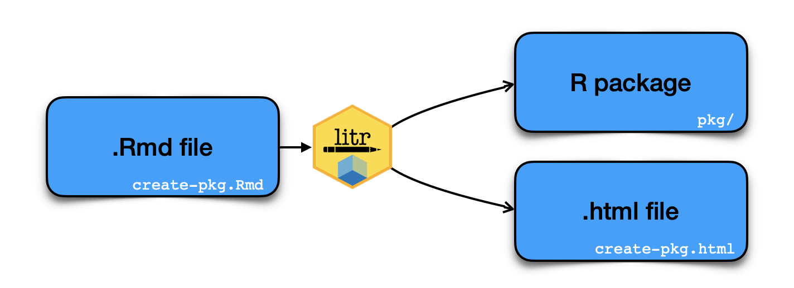

# CibStarter: The ABCs of Bioinformatics for New Lab Members
This is the ***Cover Page*** of this course (drawn by *Dr*. Li)

 

 

## 👩‍🏫👨‍🏫 Authors and maintainers 

Bo Li1,†, Youjin Hao1, Mingwei Liu2, *et al.*

1) Computational and Integrative Biology Group, College of Life Sciences, Chongqing Normal University, Chongqing 401331, China
2) Key Laboratory of Clinical Laboratory Diagnostics, College of Laboratory Medicine, Chongqing Medical University, Chongqing 400016, China

- †	Correspondence: libcell@cqnu.edu.cn (B.L.)

## **CibStarter**: 

**Note**: Here we will provide a basic course for learning bioinformatics, which includes several modules: 

| No. | Module & Course | URL | Resource | Time | Contact |
| :----: | :---- | :----: | :----: | :----: | :----: |
| 01 | EndNote简明使用教程 |  |  | Jun. 4th, 2025 | Bo Li |
| 02 | Linux零基础入门教程 |  |  | Jun. 9th, 2025 | Bo Li |
| 03 | Github多人协作开发项目的教程 |  |  | Jun. 10th, 2025 | Bo Li |
| 04 | Docker快速上手教程 |  |  | Jun. 10th, 2025 | Bo Li |
| 05 | 全方位文献检索与追踪 |  |  | Jun. 10th, 2025 | Bo Li |
| 06 | 手把手教你使用Google Scholar |  |  | Jun. 10th, 2025 | Bo Li |
| 06 | 服务器系列-Screen命令使用教程 |  |  | Jun. 10th, 2025 | Bo Li |
| 07 | 服务器系列-Nohup命令使用教程 |  |  | Jun. 10th, 2025 | Bo Li |
| 08 | 服务器系列-SSH命令使用教程 |  |  | Jun. 10th, 2025 | Bo Li |
| 09 | 服务器系列-FTP工具使用教程 |  |  | Jun. 10th, 2025 | Bo Li |
| 10 | R语言系列-shiny使用教程 |  |  | Jun. 10th, 2025 | Bo Li |
| 10 | R语言系列-R语言数据包的制作 |  |  | Jun. 10th, 2025 | Bo Li |
| 11 | 计算机系列-计算机硬件入门 |  |  | Jun. 10th, 2025 | Bo Li |
| 12 | 编程语言系列-R语言编程入门 |  |  | Jun. 10th, 2025 | Bo Li |
| 12 | 编程语言系列-Python编程入门 |  |  | Jun. 10th, 2025 | Bo Li |
| 13 | 编程语言系列-Python（动画版） |  |  | Jun. 10th, 2025 | Bo Li |